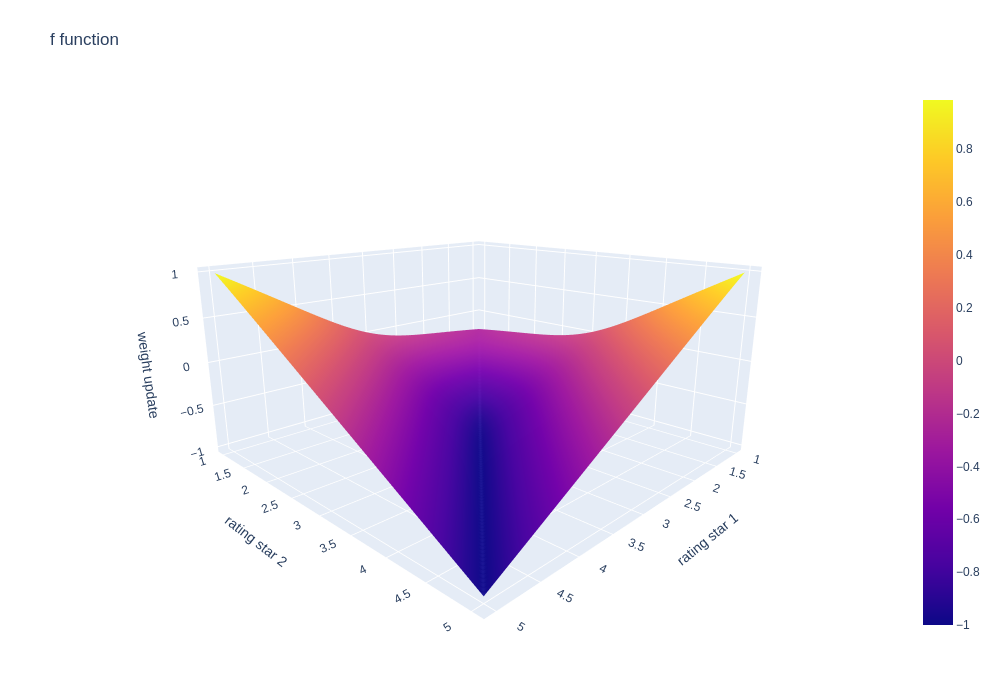

# Movie Recommendation Algorithm based on Netflix Prize Dataset 🎬🤖

Made by **WURPILLOT Nathan** and **COUBRET Erwan**

## Project Presentation

This project was made for the C programming course at the [**Telecom Physique Strasbourg**](https://www.telecom-physique.fr/) engineering school. The goal was to create a movie recommendation algorithm based on a the [**Netflix Prize dataset**](https://academictorrents.com/details/9b13183dc4d60676b773c9e2cd6de5e5542cee9a).

---

## Summary

- [**✨ How to use ?**](#%E2%9C%A8-How-to-use)

- [**⚙️ Options Commands Details**](#options-command-details)

- [**🎥 Video Tutorial**](#🎥-video-tutorial)

- [**🌳 Project Structure And Files**](#🌳-project-structure-and-files)

- [**🛠️ Algorithm Explanation**](#🛠️-algorithm-explanation)

---

## ✨ How to use ?

### 1 ─ Download dependencies and Install

- If gcc is not installed on your computer, run these commands because the `makefile` will use gcc as compiler.

```bash
$ sudo apt update
$ sudo apt install build-essential
```

- Go to [Netflix Prize dataset](https://academictorrents.com/details/9b13183dc4d60676b773c9e2cd6de5e5542cee9a) and download `nf_prize_dataset.tar.gz`

- Extract the downloaded file, and then extract `training_set.tar`

- Fork this project and pull it locally with git

### 2 ─ Use Makefile

Compile the project using the following command :

```bash
$ make
```

### 3 ─ Build Binary Files

Execute the following command to create the binary files created in order to save data with precise structure that are necessary to create the graph of recommendations :

```bash
$ ./main -o 
```

The program will then ask you to precise the path of the training_set folder.

This command will create :

- `bin_creation/movies.bin` (2,4 Go)

- `bin_creation/user.bin` (2,4 Go)

[Details about these binary files](#data-files-creation)

**🚨 Important Note :** We highly recommend you to download the `graphWHOLEBDD.bin`(1,3 Go) file to obtain the best results in a tiny amount of time.

Install git-lfs :
```bash
$ sudo apt-get install git-lfs
```

Download the graph :
```bash
$ git lfs pull
```

Here's why with an example of process time on a pc with "good" specs for 2023 (CPU : AMD R9, GPU : RTX 3060, RAM : 32Go) :

| Ratings Considered | Time to update graph |
| ---               | ---     |
| `5`               | 0.669s
| `10`              | 3.050s
| `20`              | 13.053s
| `30`              | 31.887s
| `50`              | 78.202s
| `100`             | 253.987s
| `150`             | 469.266s
| `17652 (ALL)`     | 4410.273s

### 4 ─ Recommendation algorithm

Run the following command to recommend movies using base options :

```bash
$ ./main -r <id1,id2,...>
```

### 5 ─ Options Usage

You can run the following command to get detail about the different options or check the [**⚙️ Options Command Details**](#⚙️-options-command-details) section

```bash
$ ./main -h
```

---

### ⚙️ Options Command Details

Let's take a closer look about the different options you can add to the `.\main`

By the way the order isn't important

#### 💕 Movies Liked (Option -r)

Provide a list of movies you like (separated by commas, or in a .txt file with a single movie each line) in order to get recommandation about these

Usage : `-r <movieYouLikeid1,movieYouLikeid2,...> (or the path of a .txt)`

Example : `-r 1,2,3,4,5`, `-r ../moviesILikedReallyMuch.txt`

#### 🔢 Number of Movies Recommended (Option -n)

Specify the number of movies you want to get recommended **(by default 10)**

Usage : `-n <numberOfMoviesRecommended>`

Example : `-n 20`

#### 📂 Folder Path (Option -f)

Path to the txt where the results will be saved if you want them to

Usage : `-f <path.txt>`

Example : `-f /home/movieRecommended.txt`

#### 📅 Limit Year (Option -l)

Ignore ratings whose year is greater than `year` **(by default 2006)**

**📃 Note :** ending of the database mid 2005 (so higher year will include every movies)

Usage : `-l <year>`

Example : `-l 2002`

#### 👥 Clients Considered (Option -c)

Consider only ratings from clientsID given

Usage : `-c <client1,client2...>`

Example : `-c 1,2,3,4,5`

#### ⭐ Clients Min Review Number (Option -e)

Consider only elite clients who have watched a minimum of `<minMoviesReviewed>` movies

Usage : `-e <minmoviesreviewed>`

Example : `-e 100`

#### 🚫 Reviewers Black-listed (Option -b)

Exclude ratings from reviewers <bad_reviewer1>, <bad_reviewer2>, etc.

Usage : `-b <bad_reviewer1,bad_reviewer2,...>`

Example : `-b 1,2,3,4,5`

#### ⏰ Time of the Process Indicated (Option -t)

Specify the global execution time of the algorithm

Usage : `-t`

#### 📁 Create .bin Files (Option -o)

Creates or recreates the `.bin` files : `movies.bin`, `users.bin`, `graph.bin`

**📃 Pro Tip :** combine this option the [**-z option**](#📝-number-of-ratings-considered-option--z) to specify the number of ratings considered in the `graph.bin` creation this will influence the time duration of the algorithm.

Usage : `-o`

#### 📝 Number of Ratings Considered (Option -z)

Specify the number of ratings considered for each user **(by default 30)**

Usage : `-z <num>`

Example : `-z 50`

#### 🎲 Algorithm Chosen (Option -a)

Choose the algorithm you want to use (1 or 2) (explanation of the different algorithm)[]

Usage : `-a <1 or 2>`

Example : `-a 2`

#### 📊 Save Graph (Option -g)

Save the graph in a .bin file if the following options are not used : `-l`, `-c`, `-e`, `-b`, `-s`, `-o`

Usage : `-g`

##### 🚀 Good to know

When you use the -g option to create your graph.bin after using `./main -r "likedmovies" -z "number" -g`, the next time you will call the function with the same number in the z option, the process time will only be < 1s, as the program detects the graph.bin was created for this amount of ratings considered.

For your information :

- Average ratings number given by users : 208.25

- Time taken to deserialize a downloaded/created updated graph instead of generating it each time we use the program : < 1s

> [Click here to see what the ratings considered mean](#ratings-considered-explanation)

`graphWHOLEBDD.bin` is the serialized version of the updated graph with all the ratings considered. It means that to get a recommendation, it just takes < 1s (time to deserialize the graph)

---

## 🎥 Video Tutorial

Here is a demonstration of the program (with the `graphWHOLEBDD.bin` file downloaded)


---

## 🌳 Project Structure And Files

### Structure

```bash
< Project >
     | 
     |-- bin_creation/                              
     |    |-- movies.c            # Parses the dataset/creates the movie table
     |    |-- movies.bin          # Serialized movie table         
     |    |-- user.c              # Creates the user table      
     |    |-- user.bin            # Serialized user table       
     | 
     |-- util/
     |    |-- getmovietitle.c     # Functions to get the title of a movie
     |    |-- progressbar.c       # Progress bar implementation
     |    |-- maxadvices.c        # Function to count the Lines of a file and get
     |                            # the max amount of ratings a movie has
     |
     |-- algo/                             
     |    |-- graphcreation.c     # All the functions to create/update the graph          
     |    |-- graphWHOLEBDD.bin   # The updated graph of the whole dataset 
     | 
     |-- all.h                    # Contains all the structures/global variables     
     |                        
     |-- ************************************************************************
```

You can use [Doxygen](https://www.doxygen.nl/) to generate documentation. Once installed, use :

```bash
$ make doc
```

Then open `documentation/html/index.html` in your browser

---

## 🛠️ Algorithm Explanation

### General Idea

We used our knowledge about [Graph Theory](https://en.wikipedia.org/wiki/Graph_theory) to create the recommandation algorithm. This logic will allow us to create ties between every movies. The "strength" of ties will be based on weight associated to the edges to use Graph Theory vocabulary. Using user reviews, we modify this weight in order to make the movies more or less distant. With $k$ given movies, the algorithm will recommand the $n$ closest movies based on the weights between the $k$ movies to all other movies.

### Dataset Presentation

The [Netflix Prize Dataset](https://academictorrents.com/details/9b13183dc4d60676b773c9e2cd6de5e5542cee9a) contains 2 main parts :

- `movie_titles.txt` containing each 17,700 movies ids, the release year and the title of the movie, and a folder named training_set

- `training_set` folder containing 17,770 text files, each one linked to a movie. And in files related to movies, there are the user reviews on the movies, with a user id, a star rating (between 1 and 5) and the date of the rating

You can get more information directly in the dataset.

### Data Files Creation

In order to compute things on data we needed to gather all reviews stored in the `training_set` folder. We created files that we binarized in order to reuse as we wanted the pre-processed data that will follow precise structures :

- `bin_creation/movies.bin` : a table of movies data, where the every 17,700 movie has stored its reviews and description. We used 2 structures : `movies` and `ratings` :

```c
// movie structure
typedef struct movie_temp{
    int id;
    int release_date;
    char title[300];
    int nb_ratings;
    rating* ratings;
} movie;
```

```c
// rating structure
typedef struct rating_temp{
     int id_user;
     int id_movie;
     int year;
     int day;
     int month;
     int star;
} rating;
```

- `bin_creation/user.bin` : a table of users data, where the every 480,189 users has stored their reviews. We reused the `rating` structure that will be associated this time to an `user` structure :

```c
// user structure
typedef struct user_temp{
    int id;
    int nb_ratings;
    rating* ratings;
} user;
```

### Graph of recommendation explained

#### Theoretical idea

As we mentioned in the [General Idea section](#general-idea) we needed to create a graph that represents ties between each movies so the movies will be the vertices and the ties will be the weight associated to the edges.

Every weights are initiallized with $0$ as arbitrary value.

Weights are updated based on user reviews. For each user, if he noted the same way two movies, we reduced the weight between the two movies. Otherwise, if the note is different we increased the weight between them.

Nevertheless, between two good notes and two bad notes, even with a same way of noting, we wanted to increase the reduction for positive voting. We have the idea that two movie badly-noted are surely less close than two movie well-noted.

So we developped a two parameters function $f$ that will take this in consideration :

$$
f(x,y) = (1 - \frac{1}{2} | x - y | ) \times (0.75 * \frac{1}{1 - e^{-2(x + y - 4)}} + 0.25), (x,y) \in [1,5]²
$$

The $1 - \frac{1}{2} | x - y |$ term is based in order to be equal to $1$ when $x = y$ and to decrease the more $x$ and $y$ are different.

And $0.75 * \frac{1}{1 - e^{-2(x + y - 4)}} + 0.25$ term is an adaptation of the [sigmoid function](https://en.wikipedia.org/wiki/Sigmoid_function) in oder to ponderate the weight evolution if $x$ and $y$ are low or not as we wanted.

Visual representation of the $f$ function with python (and plotly lib) :



We only needed $25$ values for all the possibilities of stars combinations (indeed the two ratings are from 1 to 5 stars). So we created a matrix of the values in order to not introduce the complicated function in the code :

```c
float weights[5][5] = {
    {-0.25, -0.17,  0.0,   0.46,  1.0},
    {-0.17, -0.62, -0.46,  0.0,   0.5},
    { 0.0,  -0.46, -1.0,  -0.5,   0.0},
    { 0.46,  0.0,  -0.5,  -1.0,  -0.5},
    { 1.0,   0.5,   0.0,  -0.5,  -1.0}
};
```

For each user, for all the different movie rating combination, the weight is updated; referred to this matrix.

#### Ratings considered explanation

Considering every reviews was too much time consuming for the graph creation in order to be used in the code, so we created a binary graph with the whole DB and we then binarized it.

Nevertheless, in order to recreate the graph in a more acceptable time, we chosen to consider only `10` to `50` first ratings per user, and the results were quite similar.

This is why when using different option that exclude some ratings (by excluding users, ratings with a certain date...), a graph recreation is needed, and the base ratings considered are `30` in our code but you can modify this value with the `-z` option.
